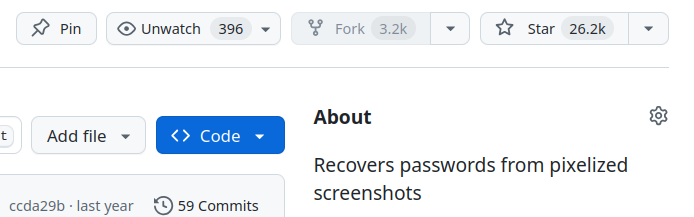
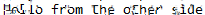
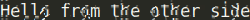

# Depix

Depix es una prueba de concepto (PoC) de una técnica para recuperar texto plano de capturas de pantalla pixeladas.

Esta implementación funciona con imágenes pixeladas creadas con un filtro de caja lineal.
En [este artículo](https://www.spipm.nl/2030.html) explico la información de fondo sobre la pixelación e investigaciones similares.

## Ejemplo


## Actualizaciones

* 24 dic. 2024: El repositorio se volvió privado, se le cambió el nombre y se volvió público. Tenía una cantidad ridícula de estrellas debido a la publicidad mediática, lo cual no me pareció bien. Creé esto como una PoC rápida para una empresa en su día, porque alguien pixeló parte de la contraseña de una cuenta con derechos de administrador de dominio. La imagen atractiva desató la expectación y, finalmente, este repositorio obtuvo 26 152 estrellas. Si vuelvo a conseguir tantas estrellas, quiero que sea por un proyecto que me entusiasme tanto.

* 27 nov. '23: Refactoricé y eliminé todo el problema de pip. Me gustan los scripts que se pueden ejecutar fácilmente. Si no se encuentra un paquete, simplemente se instala. También añadí `tool_show_boxes.py` para mostrar la precisión del detector de cajas (hay que recortar los píxeles con mucha precisión). Creé una tarea pendiente para crear una versión que simplemente recorte cajas de tamaño estático.

## Instalación

* Instalar las dependencias
* Ejecutar Depix:

```sh
python3 depix.py \
-p /path/to/your/input/image.png \
-s images/searchimages/debruinseq_notepad_Windows10_closeAndSpaced.png \
-o /path/to/your/output.png
```

## Ejemplo de uso

* Depixelizar la imagen de ejemplo creada con el Bloc de notas y pixelada con Greenshot. Greenshot promedia los valores de 0 a 255 con codificación gamma, que es el modo predeterminado de Depix.

```sh
python3 depix.py \
-p images/testimages/testimage3_pixels.png \
-s images/searchimages/debruinseq_notepad_Windows10_closeAndSpaced.png
```

Resultado: 

* Despixelizar la imagen de ejemplo creada con Sublime y pixelada con Gimp, donde el promedio se realiza en sRGB lineal. La opción backgroundcolor filtra el color de fondo del editor.

```sh
python3 depix.py \
-p images/testimages/sublime_screenshot_pixels_gimp.png \
-s images/searchimages/debruin_sublime_Linux_small.png \
--backgroundcolor 40,41,35 \
--averagetype linear
```

Resultado: 

* (Opcional) Puedes comprobar si el detector de cajas encuentra tus píxeles con `tool_show_boxes.py`. Considera usar un lote más pequeño de píxeles si la imagen se ve distorsionada. Ejemplo de cuadros con buen aspecto:

```sh
python3 tool_show_boxes.py \
-p images/testimages/testimage3_pixels.png \
-s images/searchimages/debruinseq_notepad_Windows10_closeAndSpaced.png
```

* (Opcional) Puedes crear una imagen pixelada usando `tool_gen_pixelated.py`.

```sh
python3 tool_gen_pixelated.py -i /path/to/image.png -o pixed_output.png
```

* Para obtener una explicación detallada, intenta ejecutar `$ python3 depix.py -h` y `tool_gen_pixelated.py`.

## Acerca de

### Crear una imagen de búsqueda

* Recorta los bloques pixelados de la captura de pantalla como un solo rectángulo. * Pegue una [secuencia De Bruijn](https://en.wikipedia.org/wiki/De_Bruijn_sequence) con los caracteres esperados en un editor con la misma configuración de fuente que la imagen de entrada (mismo tamaño de texto, fuente similar, mismos colores).
* Haga una captura de pantalla de la secuencia.
* Mueva esa captura de pantalla a una carpeta como `images/searchimages/`.
* Ejecute Depix con el indicador `-s` configurado en la ubicación de esta captura de pantalla.

### Creación de una imagen pixelada

* Recorte los bloques pixelados con exactitud. Consulte `testimages` para ver ejemplos.
* Intenta detectar bloques, pero no lo hace de maravilla. Experimente con el script `tool_show_boxes.py` y diferentes recortes si los bloques no se detectan correctamente.

### Algoritmo

El algoritmo aprovecha que el filtro de caja lineal procesa cada bloque por separado. Para cada bloque, pixela todos los bloques de la imagen de búsqueda para buscar coincidencias directas.

Para algunas imágenes pixeladas, Depix logra encontrar resultados de coincidencia única. Los asume como correctos. Las coincidencias de los bloques circundantes con coincidencias múltiples se comparan para determinar si están geométricamente a la misma distancia que en la imagen pixelada. Las coincidencias también se consideran correctas. Este proceso se repite un par de veces.

Una vez que los bloques correctos ya no tienen coincidencias geométricas, se generan todos los bloques correctos directamente. Para los bloques con coincidencias múltiples, se genera el promedio de todas las coincidencias.

### Limitaciones conocidas

* El algoritmo realiza la coincidencia mediante límites de bloque enteros. Como resultado, asume que, para todos los caracteres renderizados (tanto en la secuencia de De Brujin como en la imagen pixelada), el posicionamiento del texto se realiza a nivel de píxel. Sin embargo, algunos rasterizadores de texto modernos posicionan el texto con precisiones de subpíxel (http://agg.sourceforge.net/antigrain.com/research/font_rasterization/).
* Es necesario conocer las especificaciones de la fuente y, en algunos casos, la configuración de pantalla con la que se tomó la captura de pantalla. Sin embargo, si hay suficiente texto simple en la imagen original, es posible que puedas...

Usar la imagen original como imagen de búsqueda.
* Este enfoque no funciona si se realiza una compresión de imagen adicional, ya que altera los colores de un bloque.

### Desarrollo futuro

* Implementar más funciones de filtro

Crear más filtros de promedio que funcionen como algunos editores populares.

* Crear una nueva herramienta que utilice HMM

Aun así, se anima a cualquier persona interesada en este tipo de despixelización a implementar su propia versión basada en HMM y compartirla.

### Otras fuentes y herramientas

Después de crear este programa, alguien me recomendó un [documento de investigación](https://www.researchgate.net/publication/305423573_On_the_Ineffectiveness_of_Mosaicing_and_Blurring_as_Tools_for_Document_Redaction) de 2016, donde un grupo de investigadores logró crear una herramienta similar. Su herramienta tiene mayor precisión y funciona con muchas fuentes diferentes. Aunque su código fuente original no es público, existe una implementación de código abierto en [DepixHMM](https://github.com/JonasSchatz/DepixHMM).

Edición del 16 de febrero de 2022: [Dan Petro](https://bishopfox.com/authors/dan-petro) creó la herramienta UnRedacter ([artículo](https://bishopfox.com/blog/unredacter-tool-never-pixelation), [fuente](https://github.com/BishopFox/unredacter)) para resolver un [desafío](https://labs.jumpsec.com/can-depix-deobfuscate-your-data/) creado como respuesta a Depix.

Edición del 16 de abril de 2025: Jeff Geerling creó un [reto](https://www.jeffgeerling.com/blog/2025/its-easier-ever-de-censor-videos) para despixelar el contenido pixelado de una carpeta en una imagen en movimiento. Tres personas lo lograron. [Aquí](https://github.com/KoKuToru/de-pixelate_gaV-O6NPWrI) hay un repositorio de KoKuToru que muestra cómo hacerlo con TensorFlow. ¡Genial!